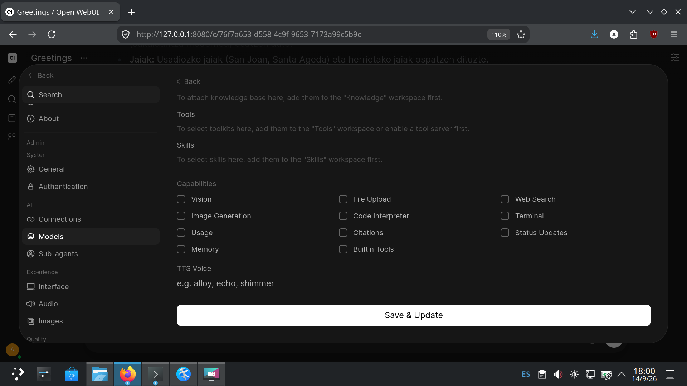
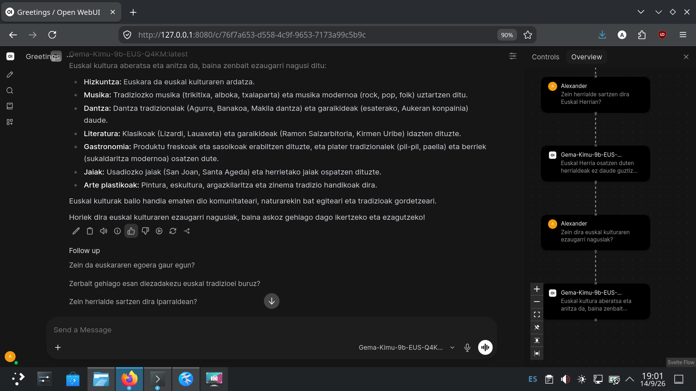

# Gemma-Kimu-9b-it FP16 Quantisations for a modest setup recall guide

Steps, settings, and issues encountered when adapting [**orai-nlp/Gemma-Kimu-9b-it**](https://huggingface.co/orai-nlp/Gemma-Kimu-9b-it) to a setup with **6 GB of VRAM**, using `llama.cpp` and `ollama-server`, by quantising the weights to a better sizes.

> [!WARNING]
> While quantising weights to lower levels and using limited context windows (8,192 tokens), **the model remains functional and reasonably quick and accurate**, but it struggles significantly to go deep into almost any topic without making mistakes or tangling itself up in its own answers.

## Hardware

- **GPU:**  NVIDIA RTX 4050 6 GB VRAM
    * NVIDIA-SMI driver:    615.71.09
    * CUDA Toolkit:         13.4

- **CPU:**  Intel I5-12450H
- **RAM:**  32 GB DDR4

## Quantisations tested

| Quant    | Fits in 6 GB? | Notes                     |
| -------- | ------------- | ------------------------- |
| Q5_K_M   | ❌            | Exceeds VRAM              |
| Q5_K_S   | ❌            | Exceeds VRAM              |
| Q4_K_M   | ✅            | **Used**. Works VERY well |
| Q4_K_S   | ✅            | Alternative               |


---

## Pipeline

### 1. About environment needed

#### About Python 

- A **dedicated virtual environment with Python 3.11** is used due to the system Python on Debian needs to be completely left untouched.  

> [!TIP]
> For the environment itself  [**`uv`**](https://github.com/astral-sh/uv) is used, which is dramatically faster than `pip` and handles Python version management cleanly

---

#### About `llama.cpp`

1.  Assuming latest NVIDIA drivers are set up and available ...:  

```bash
+-----------------------------------------------------------------------------------------+
| NVIDIA-SMI 615.71.09              KMD Version: 615.71.09     CUDA UMD Version: 13.4     |
+-----------------------------------------+------------------------+----------------------+
| GPU  Name                 Persistence-M | Bus-Id          Disp.A | Volatile Uncorr. ECC |
| Fan  Temp   Perf          Pwr:Usage/Cap |           Memory-Usage | GPU-Util  Compute M. |
|                                         |                        |               MIG M. |
|=========================================+========================+======================|
|   0  NVIDIA GeForce RTX 4050 ...    On  |   00000000:01:00.0 Off |                  N/A |
| N/A   46C    P8              3W /   60W |    5791MiB /   6141MiB |      0%      Default |
|                                         |                        |                  N/A |
+-----------------------------------------+------------------------+----------------------+

+-----------------------------------------------------------------------------------------+
| Processes:                                                                              |
|  GPU   GI   CI              PID   Type   Process name                        GPU Memory |
|        ID   ID                                                               Usage      |
|=========================================================================================|
|    0   N/A  N/A            1314      G   /usr/lib/xorg/Xorg                        4MiB |
|    0   N/A  N/A           76964      C   ./build/bin/llama-server               5768MiB |
+-----------------------------------------------------------------------------------------+
```

2. Assuming CUDA toolkit is also available:  

> [!IMPORTANT]
> Install a version matching the NVIDIA driver in use. On Debian, the NVIDIA repository must be configured first (see NVIDIA's official
instructions for your distribution).  

```bash
sudo apt install -y cuda-toolkit-<version>
```

> Then, add CUDA to `PATH` (once, in `~/.bashrc`):

```bash
echo 'export PATH=/usr/local/cuda-<version>/bin${PATH:+:${PATH}}' >> ~/.bashrc
echo 'export LD_LIBRARY_PATH=/usr/local/cuda-<version>/lib64${LD_LIBRARY_PATH:+:${LD_LIBRARY_PATH}}' >> ~/.bashrc
source ~/.bashrc
```

3. Now `llama.cpp` can be compiled from source, version `0.4.0-dev`, with CUDA enabled.

```bash
git clone https://github.com/ggml-org/llama.cpp
cd llama.cpp

cmake -B build -DGGML_CUDA=ON -DCMAKE_BUILD_TYPE=Release

cmake --build build --config Release -j$(nproc)
```

> [!WARNING]
> Without `-DGGML_CUDA=ON`, `cmake` fails with `Could not find nvcc, please set CUDAToolkit_ROOT` or `CUDA Toolkit not found`, because the toolkit is not on `PATH` by default on my setup, so remember it.

4.  **Binaries produced in `build/bin/`:**  

- `llama-quantize`: Will be used to quantise the F16 GGUF into Q4_K_M, Q4_K_S, Q5_K_M, Q5_K_S.
- `llama-server`:    Will be used to serve the model over HTTP on a local port.

---


### 2. Fetching the model


```bash
hf download <org>/<model> --local-dir ./<model>
```

> [!NOTE]
> The conversion is performed **without** embedding `chat_template.jinja`, so the template can be supplied manually later in `llama.cpp` and Ollama.

### 3. About Converting HF to GGUF (F16)

```bash
python3 convert_hf_to_gguf.py \
  ./<model> \
  --outfile ./<model>-f16.gguf \
  --outtype f16
```

This produces a full-precision GGUF (~18 GB for a 9B model).

It is only a temporal, staging artefact; the real model will be the quantised one.


---

### 4. About Quantising 

`llama.cpp` ships `llama-quantize`. The relevant quantisation types for a 9B model on 6 GB of VRAM:


| Quant    | Approx. size (9B) | Fits in 6 GB? | Notes                     |
| -------- | ----------------- | ------------- | ------------------------- |
| Q5_K_M   | ~6.5 GB           | ❌            | Exceeds VRAM              |
| Q5_K_S   | ~6.1 GB           | ❌            | Exceeds VRAM              |
| Q4_K_M   | ~5.5 GB           | ✅            | **Used**. Works very well |
| Q4_K_S   | ~5.2 GB           | ✅            | Alternative, slightly smaller |

```bash

# Q4_K_M  (recommended)
./build/bin/llama-quantize \
    ./<model>-f16.gguf \
    ./<model>-Q4_K_M.gguf \
    Q4_K_M

  
# Q4_K_S  (alternative)
./build/bin/llama-quantize \
    ./<model>-f16.gguf \
    ./<model>-Q4_K_S.gguf \
    Q4_K_S

  
# Q5_K_M  (does not fit in 6 GB, kept for reference)
./build/bin/llama-quantize \
    ./<model>-f16.gguf \
    ./<model>-Q5_K_M.gguf \
    Q5_K_M

  
# Q5_K_S  (does not fit in 6 GB, kept for reference)
./build/bin/llama-quantize \
    ./<model>-f16.gguf \
    ./<model>-Q5_K_S.gguf \
    Q5_K_S
```

Full list of supported types for reference:  

```bash
./build/bin/llama-quantize --help
...
-----------------------------------------------------------------------------
 allowed quantization types
-----------------------------------------------------------------------------

  40  or  Q1_0    :  1.125 bpw quantization
  41  or  Q2_0    :  2.25 bpw quantization (group 64)
   2  or  Q4_0    :  4.34G, +0.4685 ppl @ Llama-3-8B
   3  or  Q4_1    :  4.78G, +0.4511 ppl @ Llama-3-8B
  38  or  MXFP4_MOE :  MXFP4 MoE
   8  or  Q5_0    :  5.21G, +0.1316 ppl @ Llama-3-8B
   9  or  Q5_1    :  5.65G, +0.1062 ppl @ Llama-3-8B
  19  or  IQ2_XXS :  2.06 bpw quantization
  20  or  IQ2_XS  :  2.31 bpw quantization
  28  or  IQ2_S   :  2.5  bpw quantization
  29  or  IQ2_M   :  2.7  bpw quantization
  24  or  IQ1_S   :  1.56 bpw quantization
  31  or  IQ1_M   :  1.75 bpw quantization
  36  or  TQ1_0   :  1.69 bpw ternarization
  37  or  TQ2_0   :  2.06 bpw ternarization
  10  or  Q2_K    :  2.96G, +3.5199 ppl @ Llama-3-8B
  21  or  Q2_K_S  :  2.96G, +3.1836 ppl @ Llama-3-8B
  23  or  IQ3_XXS :  3.06 bpw quantization
  26  or  IQ3_S   :  3.44 bpw quantization
  27  or  IQ3_M   :  3.66 bpw quantization mix
  12  or  Q3_K    : alias for Q3_K_M
  22  or  IQ3_XS  :  3.3 bpw quantization
  11  or  Q3_K_S  :  3.41G, +1.6321 ppl @ Llama-3-8B
  12  or  Q3_K_M  :  3.74G, +0.6569 ppl @ Llama-3-8B
  13  or  Q3_K_L  :  4.03G, +0.5562 ppl @ Llama-3-8B
  25  or  IQ4_NL  :  4.50 bpw non-linear quantization
  30  or  IQ4_XS  :  4.25 bpw non-linear quantization
  15  or  Q4_K    : alias for Q4_K_M
  14  or  Q4_K_S  :  4.37G, +0.2689 ppl @ Llama-3-8B
  15  or  Q4_K_M  :  4.58G, +0.1754 ppl @ Llama-3-8B
  17  or  Q5_K    : alias for Q5_K_M
  16  or  Q5_K_S  :  5.21G, +0.1049 ppl @ Llama-3-8B
  17  or  Q5_K_M  :  5.33G, +0.0569 ppl @ Llama-3-8B
  18  or  Q6_K    :  6.14G, +0.0217 ppl @ Llama-3-8B
   7  or  Q8_0    :  7.96G, +0.0026 ppl @ Llama-3-8B
   1  or  F16     : 14.00G, +0.0020 ppl @ Mistral-7B
  32  or  BF16    : 14.00G, -0.0050 ppl @ Mistral-7B
   0  or  F32     : 26.00G              @ 7B
          COPY    : only copy tensors, no quantizing

```

> [!TIP]
> While the original F16 GGUF can be deleted after quantisation since only the quantised file(s) are needed at runtime, ... it is better to keep it for future reference, such as re-quantising with different parameters


---

## About testing them

### Loading on llama.cpp 

* `-c 8192` **maximum** with the KV cache in VRAM causes an **OOM**, so:
  - use `--no-kv-offload` (KV cache in system RAM)
  - maximum context tested this way: **8192** (the model is capped at its training context anyway)

  
#### Speed penalties from `--no-kv-offload`

Figures taken from the server logs (single run, no clean side-by-side benchmark):

- Prompt processing: **105.28 tok/s** (9.50 ms/token)
- Text generation: **19.19 tok/s** (52.11 ms/token)
- Total inference time: **4.35 s** (3.05 % prompt, 96.95 % generation)

Expected penalty when moving the KV cache from GPU memory (~192 GB/s on this class of card) to DDR4 (~25–50 GB/s), using the typical throughput
of a 6 GB RTX 4050 with the KV cache fully in VRAM (40–50 tok/s for a 9BQ4 model) as reference:

- vs. 40 tok/s: **52.0 %** penalty (2.08× slower)
- vs. 45 tok/s (average): **57.4 %** penalty (2.34× slower)
- vs. 50 tok/s: **61.6 %** penalty (2.61× slower)

> [!IMPORTANT]
> For such a modest setup, generation remains remarkably fast,  which is precisely why these notes and configs are kept for reproducibility.


### Loading on Ollama

- Adjust the Modelfile **TEMPLATE** manually (the GGUF does not include `tokenizer.chat_template`).

> [!WARNING]
> Gemma **does not use SYSTEM prompts** natively. The Modelfile should therefore only adjust parameters and the template.

---


## Some issues encountered

### 1. OOM in the KV cache

Already explained above.


### 2. Incorrectly typed `</s>` token (id 213)

```
W load: control-looking token: 213 '</s>' was not control-type;
this is probably a bug in the model. its type will be overridden
```

- **Cause:** in the GGUF, `</s>` is marked as type **4 (USER_DEFINED)** instead of **3 (CONTROL)**.
- **Impact:** `llama.cpp` overrides it, but **the model might not stop on its own**.

- **Solution:** add `</s>` to the `stop` list of every request and/or to the Modelfile.
- **It's a cosmetic bug sourced in the original tokenizer**.


### 3. Open WebUI `does not support tools`

```
<model>:latest does not support tools
```

- **Cause:** Open WebUI injects `tools` by default; Ollama rejects the  request if the Modelfile TEMPLATE does not contain `{{ .Tools }}`.

- **Solution:** disable Tools and Capabilities from Settings.



---

## Example of Working Modelfile (Ollama) for Q4 K M

```dockerfile
FROM /path/to/<model>-Q4_K_M.gguf

PARAMETER num_ctx 8192
PARAMETER temperature 0.7

PARAMETER stop "</s>"
PARAMETER stop "<end_of_turn>"
PARAMETER stop "<eos>"

TEMPLATE """{{ if .System }}<start_of_turn>user
{{ .System }}<end_of_turn>
{{ end }}{{ range .Messages }}{{ if eq .Role "user" }}<start_of_turn>user
{{ .Content }}<end_of_turn>
{{ else if eq .Role "assistant" }}<start_of_turn>model
{{ .Content }}<end_of_turn>
{{ end }}{{ end }}<start_of_turn>model
"""

```

Then, create it:  

```bash
ollama create <name> -f ./Modelfile
```



---

## Validated test (llama.cpp, Q4_K_M, `-c 4096 --no-kv-offload`)

**Request:**  

```bash
curl http://127.0.0.1:<port>/v1/chat/completions \
  -H "Content-Type: application/json" \
  -d '{
    "model": "<model>",
    "messages": [{"role": "user", "content": "Kaixo, nor zara zu?"}],
    "temperature": 0.7,
    "max_tokens": 200,
    "stop": ["<end_of_turn>", "</s>", "<eos>"]
  }'
```

**Response:**  

> Ni Gemma naiz, Google DeepMind-ek entrenatutako modelo linguistiko handi bat.
> Zer egin dezaket zugatik? 😊

- `finish_reason: "stop"` ✅
- Correct (batua, and literally) Basque language ✅
- **Speed:** ~18 tok/s generation, ~83 tok/s prompt.

---

## Useful tools included

Two Python scripts live under `./tools/`, used at different stages of the pipeline:

| Script | When to use it | What it does |
| --- | --- | --- |
| `./tools/00-Inspect-HF-model.py` | **Before** conversion, on the raw HuggingFace directory | Reads `config.json`, `tokenizer_config.json`, `special_tokens_map.json`, and `tokenizer.json`. Reveals special-token mapping, `add_bos`/`add_eos` flags, embedded `chat_template`, and whether tokens like `</s>` are flagged `special` or not. Catches tokenizer bugs **before** they get baked into a GGUF. |
| `./tools/01-Inspect-GGUF.py` | **After** conversion, on the resulting `.gguf` file | Reads GGUF metadata: special token IDs, the `token_type` array, the embedded `chat_template`, and flags any control-looking token that is **not** typed as `CONTROL` (type 3). This is what surfaces the classic `control-looking token: N '<x>' was not control-type` warning at source. |


### Pipeline
1. HF raw directory   →  ./tools/00-Inspect-HF-model.py
2. Convert to GGUF    →  convert_hf_to_gguf.py
3. Quantise           →  llama-quantize
4. Final GGUF         →  ./tools/01-Inspect-GGUF.py


> [!TIP]
> Run **both** scripts. The HF inspector tells you whether the bug is in the source model; the GGUF inspector tells you whether it survived the
> conversion. If only the second one complains, the problem was introduced during conversion, not upstream.


---

